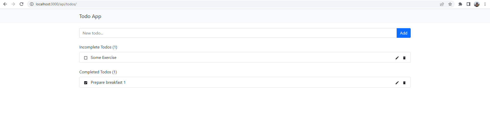
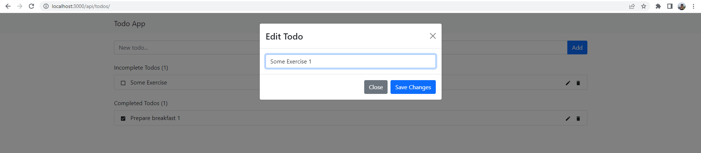

# todoApp-react-django

### Simple TODO app using Django as backend and ReactJS as frontend

#### To start the app:
1. cd to project folder:
    ```
    pip install -r requirements.txt
    python manage.py makemigrations
    python manage.py migrate
    python manage.py runserver
    ```
2. cd to frontend folder and run:
    ```
    npm install
    npm start
    ```
3. Some screenshot of this site:



